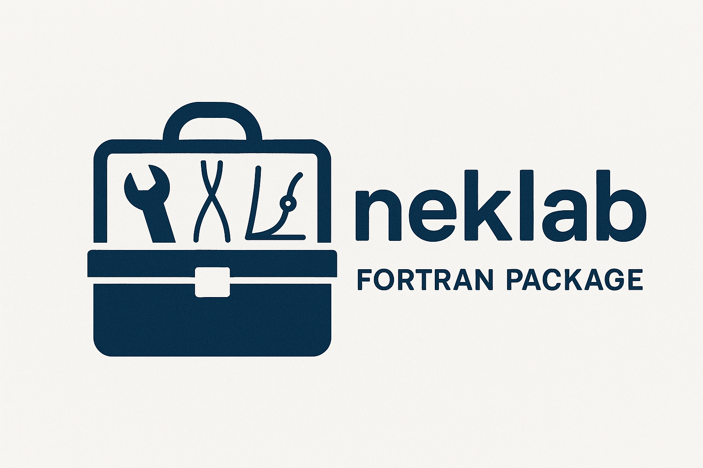

### Status

| **Documentation** | [link](https://nekstab.github.io/neklab/index.html) |
|:-------------:|:----:|
| **Contact**   | [jean-christophe.loiseau@ensam.eu](mailto:jean-christophe.loiseau@ensam.eu)    |

**Scope :**

## Description

## Capabilities

### Examples

## Installation

### Dependencies

## Contributing

## Acknowledgment

### Related projects
